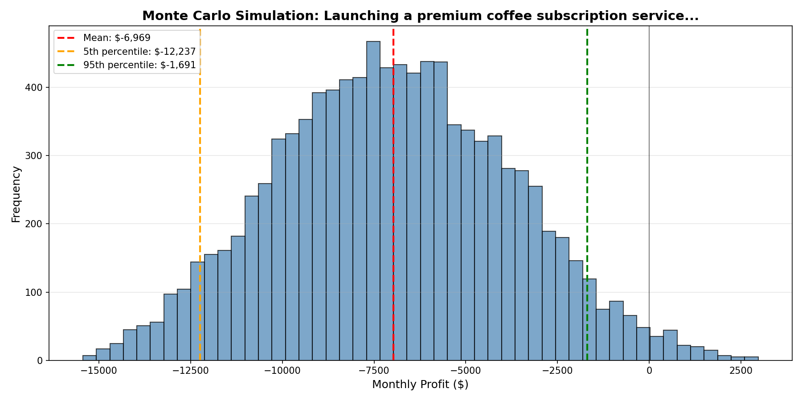
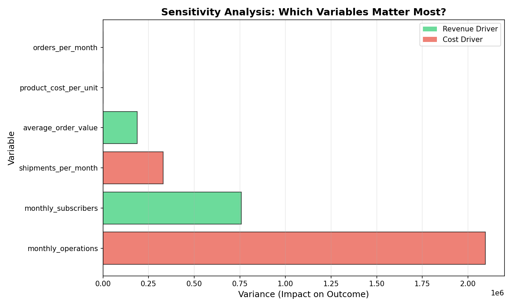

# Agentic AI System for Decision Evaluation, Risk Analysis, and Recommendation

A multi-agent AI system that evaluates business decisions using Monte Carlo simulation, sensitivity analysis, and LLM-powered reasoning.

## Overview

This system acts like a junior decision scientist or strategy analyst, helping businesses make data-driven decisions under uncertainty. Instead of relying on gut feelings or single-point estimates, it simulates thousands of possible futures and identifies key risk factors.

## The Problem

Business decisions often involve:
- Uncertain variables (customer demand, costs, market conditions)
- Multiple competing factors
- High stakes with limited information

Traditional approaches give single estimates ("revenue will be $100k"). This system provides probability distributions ("70% chance revenue is between $80k-$120k").

## Architecture

### Four Specialized Agents:

1. **Planner Agent** - Structures vague business questions into quantifiable variables
   - Input: "Should we launch a coffee subscription service?"
   - Output: Structured revenue drivers, cost drivers, and assumptions

2. **Simulator Agent** - Runs Monte Carlo simulations (10,000 scenarios)
   - Generates probability distributions
   - Calculates expected value, variance, percentiles
   - Quantifies downside risk

3. **Risk Critic Agent** - Performs sensitivity analysis
   - Identifies which variables most affect outcomes
   - Ranks factors by impact
   - Guides where to focus mitigation efforts

4. **Synthesizer Agent** - Creates executive recommendations
   - Interprets statistical results
   - Provides clear GO/NO-GO guidance
   - Suggests priority actions

## Tech Stack

- **Python 3.x** - Core language
- **NumPy** - Statistical computations and Monte Carlo simulation
- **Matplotlib** - Data visualization
- **Ollama** - Local LLM inference (llama3.2)
- **JSON** - Data interchange between agents

## Installation

1. Clone the repository
2. Create virtual environment:
```bash
   python3 -m venv venv
   source venv/bin/activate
```
3. Install dependencies:
```bash
   pip install numpy matplotlib ollama
```
4. Install and start Ollama:
```bash
   brew install ollama
   ollama serve  # In separate terminal
   ollama pull llama3.2
```

## Usage

Run the complete multi-agent system:
```bash
python agent_synthesizer.py
```

Or run individual agents:
```bash
python agent_planner.py      # Agent #1: Planning
python agent_simulator.py    # Agent #2: Simulation
python agent_critic.py       # Agent #3: Risk Analysis
```

## Example Output

**Question:** "Should we launch a premium coffee subscription service?"

**Results:**
- Mean monthly profit: -$12,624
- Probability of profitability: 0%
- Key risk factor: Monthly operations costs (variance: 2.1M)

**Recommendation:** NO-GO - Costs exceed revenue in all scenarios. Priority action: Reduce operational costs by 40% or increase subscriber base by 3x.

### Simulation Results


### Sensitivity Analysis


## Key Features

- **Uncertainty Modeling** - Uses uniform distributions (extensible to normal, triangular)
- **Statistical Rigor** - 10,000 Monte Carlo simulations per analysis
- **Visual Analytics** - Histogram distributions and sensitivity bar charts
- **Flexible Architecture** - Adapts to any business decision structure
- **Explainable AI** - Clear reasoning for all recommendations

## Learning Outcomes

This project demonstrates:
- Monte Carlo simulation for decision analysis
- Sensitivity analysis and risk quantification
- Multi-agent AI system design
- Statistical modeling (mean, variance, percentiles, probability)
- LLM prompt engineering
- Production-quality Python code architecture

## Future Enhancements

- [ ] Add correlation between variables
- [ ] Implement time-series forecasting (12-month projections)
- [ ] Support triangular and normal distributions
- [ ] Web interface for non-technical users
- [ ] Export results to PDF reports
- [ ] Add scenario comparison features

## Author

Anoushka Dighe

## License

MIT License
